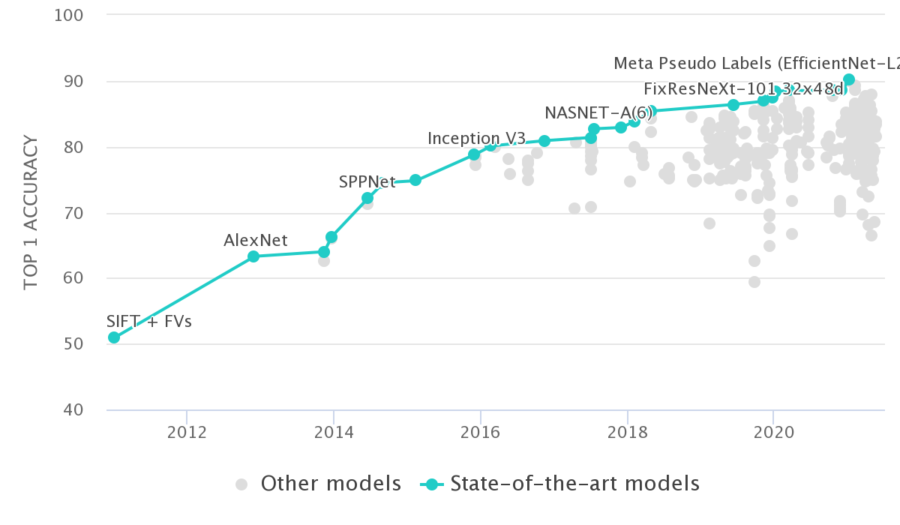
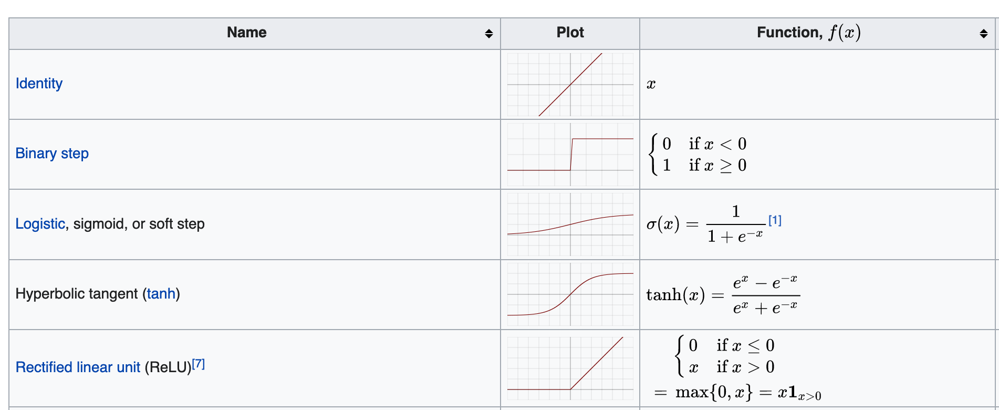
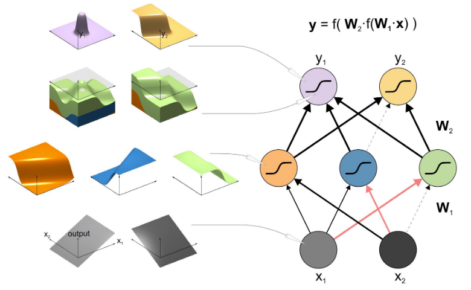
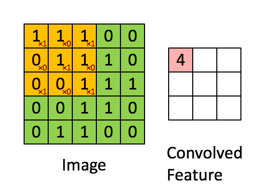
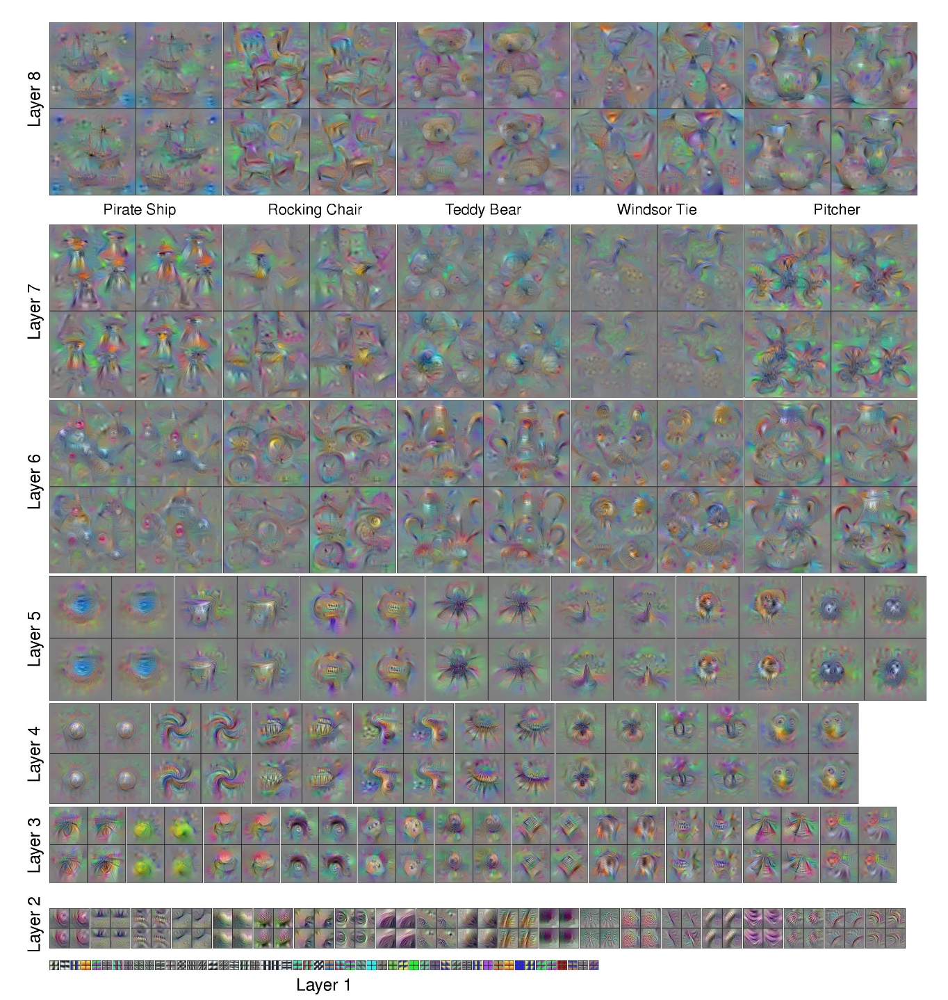
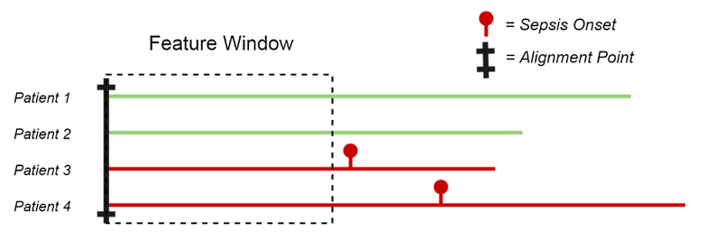
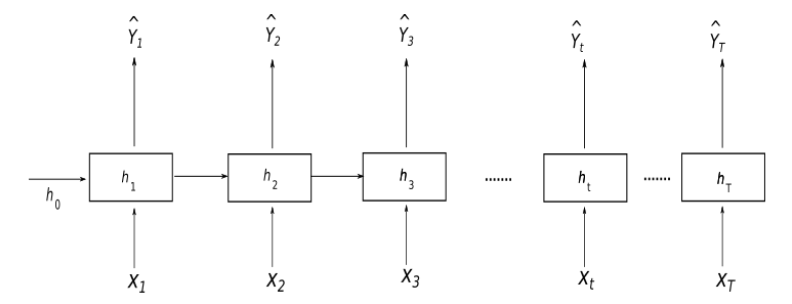

class: inverse

```{r, include=FALSE}
suppressPackageStartupMessages({
  library(tidyverse)
  library(palmerpenguins)
})

library(RefManageR)
BibOptions(check.entries = FALSE,
           bib.style = "authoryear",
           cite.style = "alphabetic",
           style = "markdown",
           hyperlink = FALSE,
           dashed = FALSE)
bib <- ReadBib("./acb.bib", check = FALSE)

theme_set(cowplot::theme_cowplot())
```


# What we'll cover


1. Feed forward neural networks
2. Training neural nets: backpropagation
3. Convolutional neural networks
4. Recurrent neural networks
5. Autoencoders revisited


---

# Image classification



.footnote[
 https://paperswithcode.com/sota/image-classification-on-imagenet
]

---

# The perceptron

The perceptron `r Cite(bib, "rosenblatt1958perceptron")` early example of "biologically inspired" learning

Predict a binary output given input $x$ via

$$
f(\mathbf{x})=\left \\{
\begin{aligned}
1 & \text{ if } \mathbf{w}\cdot \mathbf{x}+b > 0, \\
0 & \text{ otherwise}
\end{aligned}
\right.
$$

* $f(x)$ classifies sample as 0 or 1 depending on $x$ 

* Iteratively adjust $w$, $b$ to get $f(x)$ to match ground truth on a training dataset

---

# Linear decision boundary

.center[

]

.footnote[
Elizabeth Goodspeed, CC BY-SA 4.0 , via Wikimedia Commons
]

---

# Multi-layer perceptrons

Previously:

--

$$
f(\mathbf{x})=\left \\{
\begin{aligned}
1 & \text{ if } \mathbf{w}\cdot \mathbf{x}+b > 0, \\
0 & \text{ otherwise}
\end{aligned}
\right.
$$
--

Rather than compare $f(x)$ to our ground-truth, use it as input to a second function:

$$
g(\mathbf{x})=\left \\{
\begin{aligned}
1 & \text{ if } v f(\mathbf{x}) + c > 0, \\
0 & \text{ otherwise}
\end{aligned}
\right.
$$
* Typically use multiple $f$s as input

* Now want to adjust $\mathbf{w}$, $\mathbf{b}$, $v$, $c$ to make $g(x)$ as close to output as possible

--

Remember (from ACB-I) want to minimize $\mathrm{LOSS}(\mathbf{y}, g(\mathbf{x}))$


---

# Activation functions

In the perceptron the output of each layer is set to 0 or 1:

$$
f(\mathbf{x})=\left \\{
\begin{aligned}
1 & \text{ if } \mathbf{w}\cdot \mathbf{x}+b > 0, \\
0 & \text{ otherwise}
\end{aligned}
\right.
$$
Many possible _activation functions_ with appealing properties:

.center[

]

.footnote[
 https://en.wikipedia.org/wiki/Activation_function
]

---

# DNNs visualized

.center[

]

Figure: `r Cite(bib, "kriegeskorte2019neural")`

---

background-image: url('intro-ml_figs/mountain.jpg')
background-position: center
background-size: contain
class: inverse


# Gradient descent


You're at the top of a mountain, it's getting dark, and you need to get down
--
 
* Your position $(x,y)$ is your parameter space $(w,b)$ to explore

--
 
* Your height is your loss you want to minimize

--

## Q: What's the strategy?

--

Take successive little steps downhill until things flatten out

--

## Local optimality

Note this doesn't guarantee you to get to the _bottom_, only to a much flatter region

 `r icon::fontawesome("arrow-right")` Big problem depending on shape of your mountain / loss function

---

# What is downhill?

> successive little steps downhill

--

.pull-left[
Consider $y=(x-1)^2$, $\frac{\mathrm{d}y}{\mathrm{d}x} = 2(x-1)$
]

.pull-right[
```{r, echo=FALSE, fig.align='center', fig.width=4,fig.height=4}
ggplot() + xlim(-3, 5) + 
  geom_function(fun = function(x) (x-1)^2) + 
  geom_vline(xintercept = 1, color='grey50', linetype=2) +
  labs(x="x", y="y")
```
]

--

Notice:
* When $x > 1$ we want to go to the _left_ and $\frac{\mathrm{d}y}{\mathrm{d}x} > 0$
* When $x < 1$ we want to go to the _right_ and  $\frac{\mathrm{d}y}{\mathrm{d}x} < 0$

The sign of the gradient always points uphill!

---

# Gradient descent

This suggests an iterative scheme:

1. Initialize some values for $(w,b)$

--

2. For a given number of steps:
 * Update $w \leftarrow w - \epsilon \frac{\partial}{\partial w} \mathrm{LOSS(f(\mathbf{x}), \mathbf{y}; w, b)}$
 * Update $b \leftarrow b - \epsilon \frac{\partial}{\partial b} \mathrm{LOSS(f(\mathbf{x}), \mathbf{y}; w, b)}$

--

3. Monitor $\mathrm{LOSS(f(\mathbf{x}), \mathbf{y}; w, b)}$ - if it "levels off" we can end with the optimal values $(w,b)$

--

## Learning rate

$\epsilon>0$ is known as the _learning rate_ or _step size_. 

* Important parameter to tune: too large and you overshoot, too small and it's inefficient

---

# Backpropagation in one slide

To use gradient descent to train our neural network we need to compute

$$\frac{\partial}{\partial \theta_i} \mathrm{LOSS}(f(\mathbf{x}), \mathbf{y}; \mathbf{\theta})$$
where $\mathbf{\theta}$ are all the parameters of the neural network

--

.pull-left[

_Backpropagation_ is an efficient way of computing these derivatives using the chain rule and storing intermediate values

Recall chain rule: if $y = g(f(x))$ then $\frac{dy}{dx} = \frac{d g}{d f}\frac{df}{dx}$

Deep NNs often composition of functions, e.g.

$$\text{LOSS}(\text{activation}(\text{linear}(\textbf{x})))$$
]

.pull-right[

.footnote[
https://colah.github.io/posts/2015-08-Backprop/
]
]


---

# Deep neural networks for imaging data

Images are large!

CIFAR-10 dataset has "small" images (32x32x3) `r icon::fontawesome("arrow-right")` 32x32x3 = 3072 weights for each neuron in input layer

--

A biologically-inspired solution to this is **convolutional neural networks** (CNNs)

--

1. **Convolutional layer**

  Scans a set of learnable filters across the image

--
  
2. **Pooling layer**

  Spatially downsamples / pools output

--

3. **Fully connected layer**

  Computes output probabilities (similar to feed forward network)


---

# Convolutional layer

.pull-left[
.center[

]
]

.pull-right[
  
  ### Key hyperparameters:
  
  * Width, height
  
  * Stride (how big a step do you take?)
  
  * How many features?
  
]

.footnote[
<sup>https://www.coursera.org/learn/convolutional-neural-networks/home/</sup>
]

---

# (Max) pooling layer


.center[
  
  ]
  
* Reduces dimensionality via local aggregation

* Multiple variations depending on aggregation operation (max, mean)

.footnote[
<sup>https://en.wikipedia.org/wiki/File:Max_pooling.png</sup>
]

---

# What do CNNs learn?

.center[
  
  ]

.footnote[
  `r Citep(bib, "yosinski2015understanding")`
]

---

# Image augmentation

The meaning of images are subject to a set of _invariances_

**Example**: A photo of a chair upside-down is still a chair

--

One strategy is to feed augmented training data in to reflect these invariances (rotations, translations, altered colouring, skew,...)

--

.center[

]


---

# Deep neural networks for temporal data

Often data is has inherent ordering, e.g.:

* Time series data 

* Textual data

Can represent this via $y_t$ for $t=1,\ldots,T$

--

Typical task is to predict future values given past

--

.center[

]

.footnote[
<sup>`r Cite(bib, "fleuren2020machine")`</sup>
]
--

### Why might a standard (feed forward) net not work so well here?


---

# Recurrent neural networks

Time dependent input-output pairs $(x_t, y_t)$ for $t=1,\ldots,T$, e.g.:

* $x$ = english words, $y$ = french words  `r icon::fontawesome("arrow-right")` translation

* $x$ = image, $y$ = caption  `r icon::fontawesome("arrow-right")` image captioning

--


RNNs compute a hidden state $h_t$ that's a function of $x_t$ and $h_{t-1}$

$h_t = g_1(x_t, h_{t-1})$

$y_t = g_2(h_t)$

.center[

]

.footnote[
<sub>Figure: `r Cite(bib, "schmidt2019recurrent")`</sub>
]

---

class: middle, inverse

### Example: predict next character in sequence

.center[

]

.foonote[
Figure: http://karpathy.github.io/2015/05/21/rnn-effectiveness/
]

---

class: middle, inverse


.center[

]

.foonote[
Figure: http://karpathy.github.io/2015/05/21/rnn-effectiveness/
]

---

# More recent developments in sequence modelling

## Long short term memory networks (LSTMs, `r Cite(bib, "hochreiter1997long")`) 

* Allow for long range dependencies

* Fantastic blog post: https://colah.github.io/posts/2015-08-Understanding-LSTMs/

## Transformer models

* Use _attention_, a form of adaptive input weighting

* Modern examples applied to language include GPT, BERT

---

# Deep learning in genomics

Many applications including

1. Predicting sequence specificity of DNA binding proteins

2. Predict methylation based on genome topology, DNA sequence

3. Predict expression from sequence

Good intro reading: `r Citep(bib, "zou2019primer")`

--

## In practice...

Deep neural networks are **universal function approximators**

Consequently, they are **data hungry**

Think $>1000$ samples before reaching for a DNN

---

# References

These slides: [camlab.ca/teaching](https://www.camlab.ca/teaching)

<small>
```{r refs, echo=FALSE, results="asis"}
PrintBibliography(bib)
```
</small>

