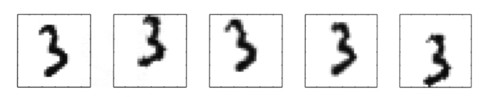
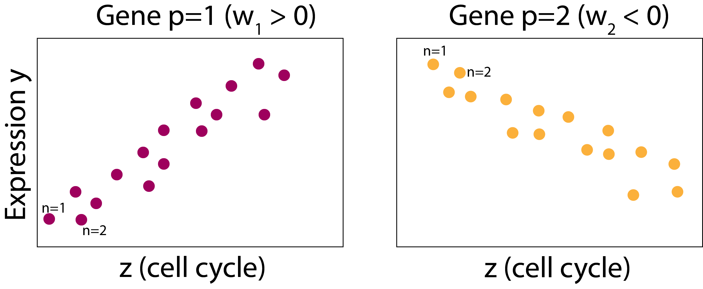
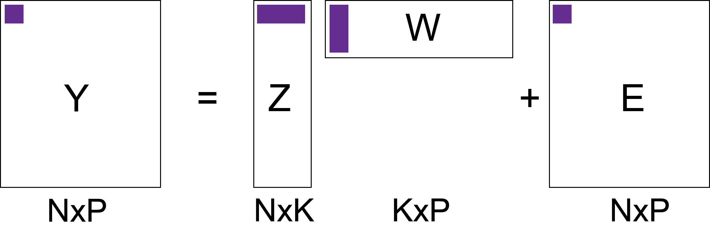
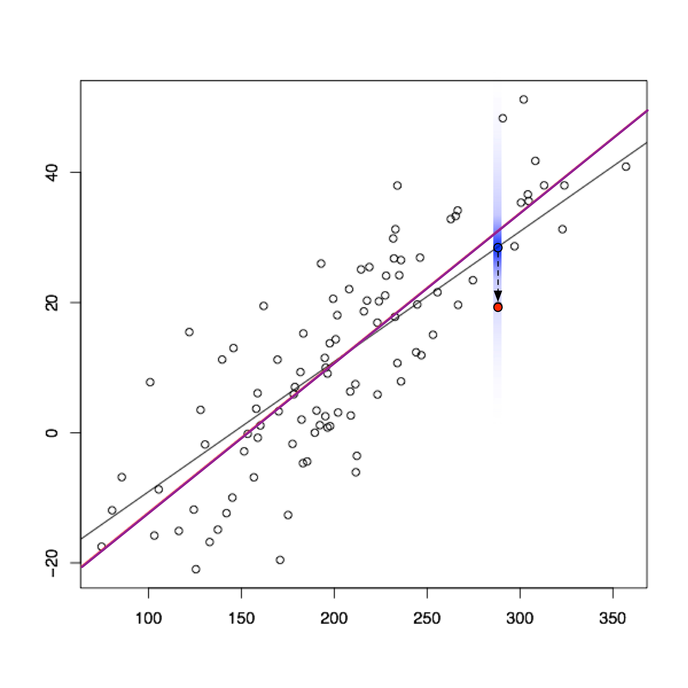
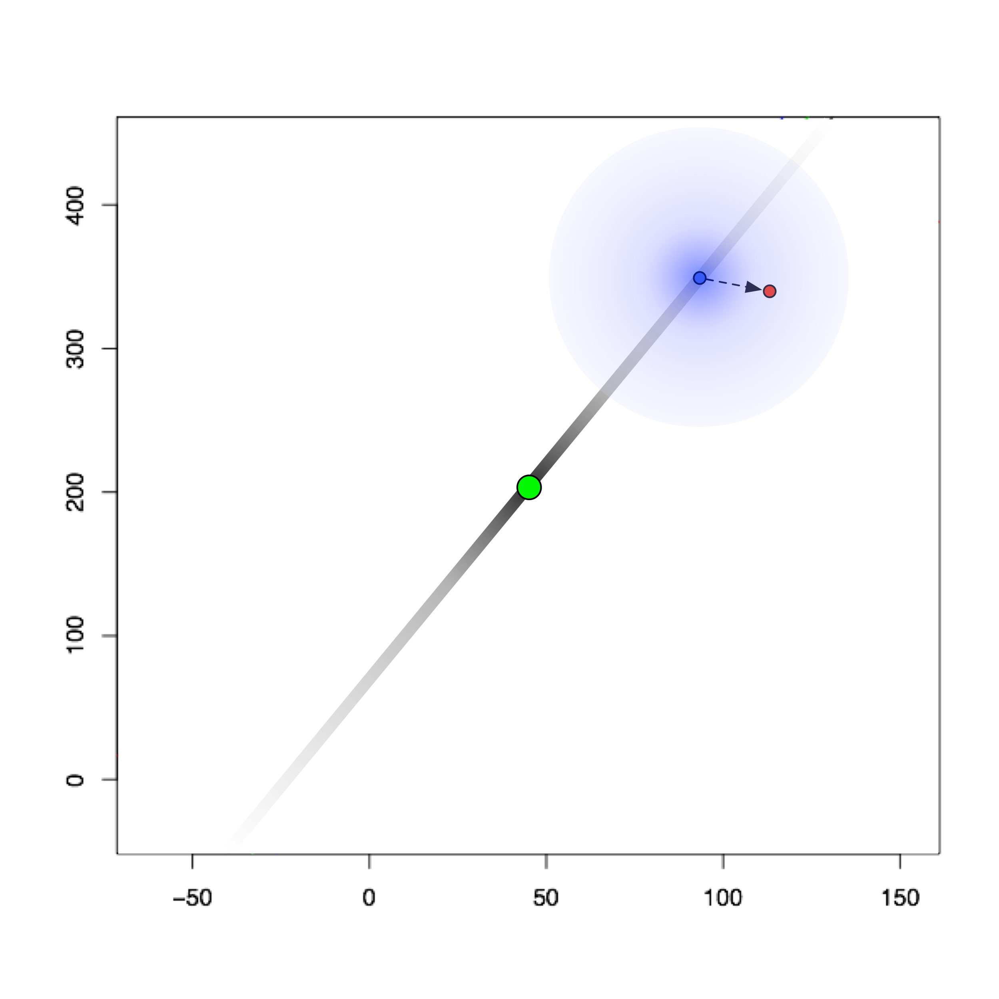
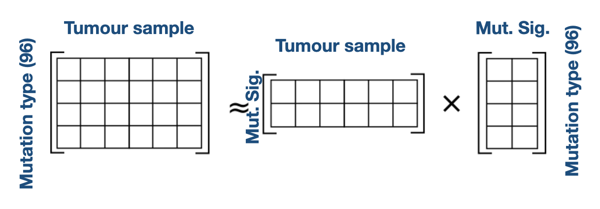
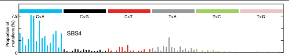
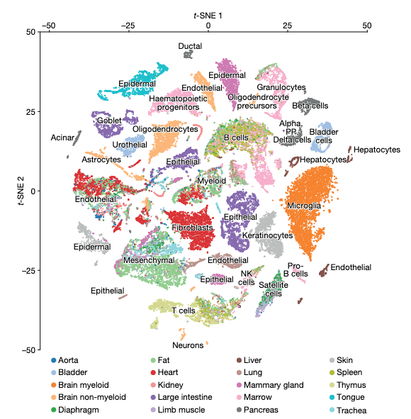

class: inverse, middle

```{r, include=FALSE}
suppressPackageStartupMessages({
  library(tidyverse)
  library(palmerpenguins)
})

library(RefManageR)
BibOptions(check.entries = FALSE,
           bib.style = "authoryear",
           cite.style = "alphabetic",
           style = "markdown",
           hyperlink = FALSE,
           dashed = FALSE)
bib <- ReadBib("./acb.bib", check = FALSE)

theme_set(cowplot::theme_cowplot())
```


# What we'll cover


1. A historical perspective on continuous latent variable models
2. Principal component analysis and pPCA
3. Non-negative matrix factorization
4. Nonlinear methods: tSNE & autoencoders

---

# Conventions

* We'll have $N$ samples indexed $n = 1, \ldots, N$

--

* When an output is multidimensional, we'll refer to output dimensions as $p=1,\ldots,P$

--

* We define a _latent variable_ as a sample specific unobserved variable
  * e.g. "What cluster does sample $n$ belong to?"
  
--

* Latent variables are $z_n$ (possibly high dimensional, possibly discrete)

--

* Observed variables are $y_n$


---

# Why use continuous latent variables?

Many high-dimensional data are generated from an intrinsically lower-dimensional space ("manifold")

--

## Examples:

* Imaging data: images have lower intrinsict degrees of freedom than length $\times$ height pixels

.center[

]
.footnote[
Figure credit: `r Cite(bib, "bishop2006pattern")`
]

* Single-cell transcriptomic data

---

# Origins of continuous latent variable models

`r Citet(bib, "spearman1961general")` noted in 1904 correlation between pupil's school grades:

| Student |  Maths |  English |  Science | 
| -- | -- | -- | -- |
| Alice | 68 | 79 | 65 |
| Bob | 56 | 47 | 60 | 
| Carol | 92 | 85 | 84 | 
| ... | ... | ... | ... |

--

> What if the grades aren't just correlated with each other, but depend on an unseen ("latent") variable...called _general intelligence_ ?


  
---

# Origins of continuous latent variable models

How would we describe this mathematically? 

--

* $y_{np}$ grade of pupil $n$ in subject $p$
* $z_n$ "intelligence" pupil $n$
* $w_{p}$ describes how the intelligence impacts the grade

--

Then

$$y_{np} = w_p z_n + \epsilon_{np}$$
where $\epsilon_{np}$ is the error term

--

This (vastly oversimplified) model is not a good model of reality. More reading:

https://www.stat.cmu.edu/~cshalizi/402/lectures/18-factors/lecture-18.pdf


---

# Modern applications

Where do such models appear today?

--

Anywhere with high dimensional data, especially genomics

--

## Single-cell gene expression data 

* $y_{np}$ expression gene $p$ in cell $n$
* $z_n$ cell cycle progression of cell $n$
* $w_p$ how cell cycle influences gene $p$

$$y_{np} = w_p z_n + \epsilon_{np}$$
--

.center[

]


---

# Latent variable models as matrix factorization

Suppose we model $K$ latent variables rather than just 1

$$y_{np} = \sum_{k=1}^K w_{pk} z_{nk} + \epsilon_{np}$$

--

In matrix form:

$$
\begin{aligned}
\mathbf{Y} = \mathbf{Z}  \mathbf{W}   + \mathbf{E}
\end{aligned}
$$
--



---

# Some notes 

.center[

]

--

* Dimensionality reduction: for each $n$ we find a lower dimensional representation (length $K$ rather than $P$)

--

* Also (probabilistic) matrix factorization

--

* We've said nothing about $Y$, $Z$, $W$, $E$. Depending on these:
  * PCA, probabilistic PCA
  * Factor analysis
  * Non-negative matrix factorization
  

---

# Principal component analysis

Aims to project data onto a space $K < P$  such that

--

* Each of the $K$ components are orthogonal

--

* The projection of points onto the first component retains the most variance

--

* Projection onto second retains second most variance

--

* ...


---

# Principal component analysis visualized

.pull-left[
* $P=2$, $K=1$
  
* White dots are observed data

* Green line is the subspace (principal component) 

* Blue dots are projections onto the principal component

  
]

.pull-right[
.center[

]
]
.footnote[
Image credit: Lior Pachter https://liorpachter.wordpress.com/2014/05/26/what-is-principal-component-analysis/
]

---

# Differences from linear regression

.center[

]

.footnote[
Image credit: Lior Pachter https://liorpachter.wordpress.com/2014/05/26/what-is-principal-component-analysis/
]
---

# Calculation of principal components

Let $\mathbf{u}_1 \in \mathbb{R^P}$ project each data point onto the first principal component:

$$z_{n1} = \mathbf{u}_1^\mathrm{T} \mathbf{y}_n$$

such that $\mathbf{u}_1^\mathrm{T} \mathbf{u}_1 = 1$

--

Then as shown in `r Citet(bib, "bishop2006pattern")`, to find $\mathbf{u}_1$ we solve the eigenvalue equation

$$S\mathbf{u}_1 = \lambda \mathbf{u}_1$$
--

Where $S$ is the $P \times P$ empirical covariance

$$S = \frac{1}{N} \sum_{n=1}^N (\mathbf{y_n} - \bar{\mathbf{y}}) (\mathbf{y_n} - \bar{\mathbf{y}})^\mathrm{T}$$

--

$\mathbf{u}_1$ is the eigenvalue corresponding to the largest eigenvalue $\lambda$, $\mathbf{u}_2$ second largest, etc.

---

# An penguin example

```{r, echo=FALSE, layout="l-body-outset"}
data("penguins")
penguins <- drop_na(penguins)
penguins <- penguins[c(1,3,4,5,6)]
knitr::kable(penguins[1:4,])
```
--

```{r, echo=FALSE, fig.width=4,fig.height=3, fig.align='center'}
ggplot(penguins, aes(x = bill_length_mm, y = bill_depth_mm, colour=species)) +
  geom_point()
```


---

# An penguin example (II)

```{r, echo=FALSE, layout="l-body-outset"}
knitr::kable(penguins[1:4,])
```

* $P$ is {bill_length_mm, bill_depth_mm, flipper_length_mm, body_mass_g}
* $N$ is each row (each individual penguin measured)


---

# PCA on Penguins

```{r}
peng_mat <- scale(as.matrix(penguins[,2:5]))
pca <- prcomp(peng_mat)
```

--

We can look at $\mathbf{u}_1, \ldots, \mathbf{u}_4$:

```{r}
pca$rotation
```

--

And the projections $\mathbf{z}_1$:

```{r}
head(pca$x, n=1)
```


---

# Calculating the projections

Recall $\mathbf{z}_{1} = \mathbf{u}_1^\mathrm{T} \mathbf{y}$:

```{r}
t(pca$rotation[,1,drop=FALSE]) %*% peng_mat[1,]
```

and verify this is what's calculated by `prcomp`:

```{r}
pca$x[1,1]
```

---

# Graphing the results

```{r, fig.width=5,fig.height=5, fig.align='center'}
df <- as_tibble(pca$x) %>% mutate(species = penguins$species)

ggplot(df, aes(x = PC1, y = PC2, colour = species)) +
  geom_point()
```


---

# Probabilistic PCA

Variant of PCA called probabilistic PCA (pPCA)

.center[

]

specified by the following probabilistic model:

$$\mathbf{z}_n \sim \mathcal{N}(0,1)$$

$$\mathbf{y}_n = \mathcal{N}(\mathbf{W}^\mathrm{T}\mathbf{z}_n, \sigma^2 \mathbf{I}) $$
--

* Can derive a computationally-efficient EM algorithm that avoids computing full covariance matrix

* Allows for missing data

* Building block for more interesting probabilistic models


---

# Visual representation of pPCA

.center[

]

.footnote[
Image credit: Lior Pachter https://liorpachter.wordpress.com/2014/05/26/what-is-principal-component-analysis/
]


---

# The rotation problem

Remember $\mathbf{y}_n \sim \mathcal{N}(\mathbf{W}^\mathrm{T}\mathbf{z}_n, \sigma^2 \mathbf{I})$

where $\mathbf{W}$ is $K \times P$ and $\mathbf{z}_n$ is $K \times 1$

--

We can introduce a $K \times K$ rotation matrix $R$ s.t. $RR^\mathrm{T}=\mathbf{I}$ and get

$$
\begin{aligned}
\mathbf{W}^\mathrm{T}\mathbf{z}_n & = \mathbf{W}^\mathrm{T}\mathbf{I} \mathbf{z}_n \\ 
& = \mathbf{W}^\mathrm{T} R R^\mathrm{T} \mathbf{z}_n \\
& = (R^\mathrm{T} \mathbf{W})^\mathrm{T}  R^\mathrm{T} \mathbf{z}_n \\
& =\tilde{\mathbf{W}}^\mathrm{T} \tilde{\mathbf{z}}_n
\end{aligned}
$$
--

In other words we can get _exactly_ the same likelihood for a rotated solution $\tilde{\mathbf{W}}$, $\tilde{\mathbf{z}}_n$ !

---

# Non-negative matrix factorization


`r Citet(bib, "paatero1994positive")` introduced NMF 

.center[

]

$\mathbf{Y}, \mathbf{Z}, \mathbf{W}$ are _all non-negative_

--

Solutions found via minimizing

$$\sum_{n=1}^N \sum_{p=1}^P \left(\mathbf{Y} - \mathbf{Z}\mathbf{W} \right)_{np}^2$$
--

This is a hard, _non unique_ optimization problem

Nice discussion: https://blog.acolyer.org/2019/02/18/the-why-and-how-of-nonnegative-matrix-factorization/


---

# Applications of NMF

Very popular in computational biology

--

* Data $\mathbf{Y}$ is often non-negative (counts, intensities)

--

* $\mathbf{W}$ being non-negative provides a "contribution" from each component $K$

--

* If $z_{nk} = 0$, component $k$ is _inactive_ in sample $n$

--

* If $z_{nk}$ is large, component $k$ is _active_ in sample $n$


---

# Example: mutational signatures

How do we find common patterns of mutation along the genome?

--

Think of all _trinucleotide_ substitutions, e.g. `ACG` `r icon::fontawesome("arrow-right")` `AAG` 

--

There are $96$ possible mutations `r icon::fontawesome("arrow-right")` $N \times 96$ count matrix

--

Apply NMF to this matrix:


.center[

]


---

# Example: mutational signatures (II)

.pull-left[
Each of the $K$ components is known as a _mutational signature_
]
.pull-right[
.center[

]
]

--

Each tumour sample is then defined by activation of multiple mutational signatures (via $\mathbf{Z}$)

--

Each mutational signature is defined by contributions from each mutation type

.center[

]

.footnote[
Figure: `r Citet(bib, "alexandrov2020repertoire")`
]

Often associated with known mutational processes, e.g. double strand break repair, UV light exposure, etc.


---

# Nonlinear dimensionality reduction

So far all mappings have been linear:

* $z$ `r icon::fontawesome("arrow-right")` $y$ via $\mathbf{y} = \mathbf{W}^\mathrm{T} \mathbf{z}$ (e.g. pPCA, NMF)
* $y$ `r icon::fontawesome("arrow-right")` $z$ via $z = \mathbf{u}^\mathrm{T} \mathbf{y}$ (PCA)

but we may wish to learn more flexible, nonlinear embeddings that capture more complex structure

--

Let's look at

1. tSNE

2. Autoencoders

---

# t-distributed stochastic neighbour embedding  (tSNE)

<!-- Compute "conditional neighbour probabilities" -->

<!-- $$p_{j|i} = \frac{\exp(-||\mathbf{y}_i - \mathbf{y}_j||^2/2\sigma_i^2)}{\sum_{k\neq i} \exp(-||\mathbf{y}_i - \mathbf{y}_k ||^2/2\sigma_i^2)}$$ -->
<!-- and symmetrize to make $p_{ij} = (p_{j|i} + p_{i|j})/2N$ -->

<!-- then introduce -->

<!-- $$q_{ij} = $$ -->

tSNE `r Cite(bib, "van2008visualizing")` is a method for learning non-linear reduced-dimension representations

.pull-left[
* No explicit forward or reverse map

* _Perplexity_ parameter controls crowdedness of representation

* Reproduces local similarity more faithfully than global similarity

* _Very_ popular in single-cell transcriptomics


**How to Use t-SNE Effectively**: https://distill.pub/2016/misread-tsne/


]

.pull-right[
.center[

]
]


.footnote[
Image: `r Cite(bib, "tabula2018single")`
]


---

# Autoencoders

One approach is to

1. Map $y$ to $z$ using a deep neural network (the _encoder_)

--

2. Map $z$ to a reconstructed $\hat{y}$ using a second deep neural network (the _decoder_)

--

3. Adjust the parameters of both networks to minimize $(y - \hat{y})^2$


---

# Deep neural networks

Let $\mathbf{x} = x_1, x_2, x_3$ be the inputs

--

(feed forward) neural networks reach an output by iteratively applying:

* Linear layer: $\sum_i w_i x_i + b$
* A non-linearity such as sigmoid, tanh

to map from input $\mathbf{x}$ to output $y$

--

.center[

]

---

# Autoencoders

Introduce _encoder_ network parameterized by $\theta$: 

$$\mathbf{z} = \texttt{enc}_\theta(\mathbf{y})$$
--

_Decoder_ to map back to predicted values $\hat{\mathbf{y}}$:

$$\hat{\mathbf{y}} = \texttt{dec}_\phi(\mathbf{z}) = \texttt{dec}_\phi(\texttt{enc}_\theta(\mathbf{y}))$$
--

Then update $\phi$, $\theta$ to minimize

$$(\mathbf{y} - \hat{\mathbf{y}}^2) = (\mathbf{y} - \texttt{dec}_\phi(\texttt{enc}_\theta(\mathbf{y})))^2$$
--

Since $\mathbf{z}$ is of size $K < P$ this performs nonlinear dimensionality reduction

--

Becoming very popular in single-cell RNA-sequencing, see e.g. `r Cite(bib, "lopez2018deep")`


---


# References

These slides: [camlab.ca/teaching](https://www.camlab.ca/teaching)


```{r refs, echo=FALSE, results="asis"}
PrintBibliography(bib)
```


