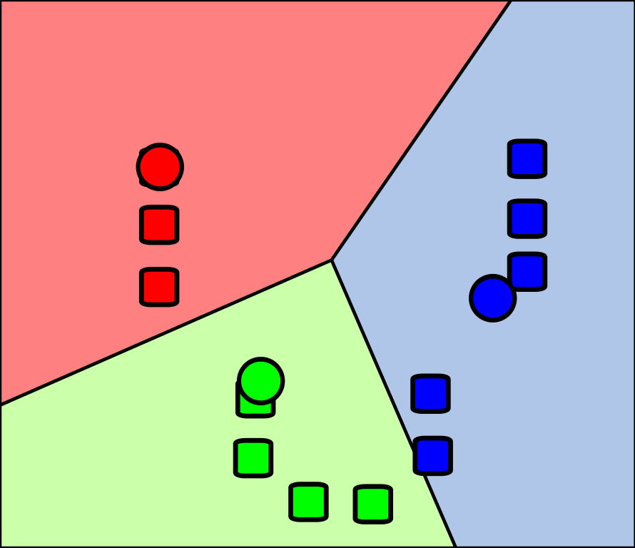
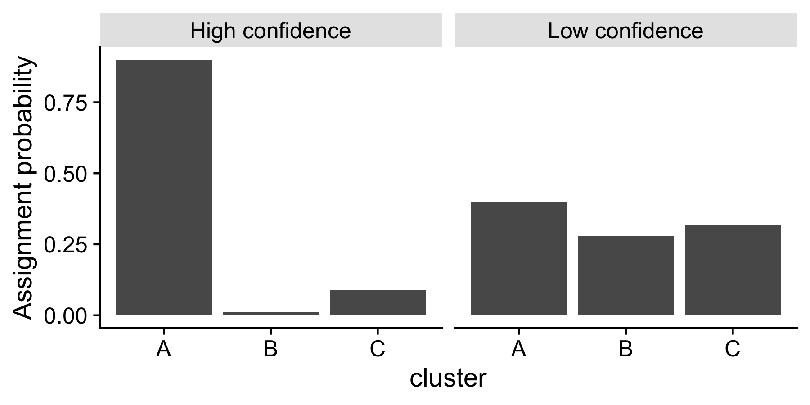

class: inverse, middle

```{r, include=FALSE}
suppressPackageStartupMessages({
  library(tidyverse)
  library(palmerpenguins)
})

library(RefManageR)
BibOptions(check.entries = FALSE,
           bib.style = "authoryear",
           cite.style = "alphabetic",
           style = "markdown",
           hyperlink = FALSE,
           dashed = FALSE)
bib <- ReadBib("./acb.bib", check = FALSE)

theme_set(cowplot::theme_cowplot())
```

```{css, echo=FALSE}
.footnote {
  border-top: 2px solid black;
}
```

# What we'll cover


* Clustering from a probabilistic perspective
* Gaussian Mixture Models
* Expectation-maxization
* Model selection


<!-- --- -->

<!-- # Conventions -->

<!-- * We'll have $N$ samples indexed $n = 1, \ldots, N$ -->

<!-- -- -->

<!-- * When an output is multidimensional, we'll refer to output dimensions as $p=1,\ldots,P$ -->

<!-- -- -->

<!-- * We define a _latent variable_ as a sample specific unobserved variable -->
<!--   * e.g. "What cluster does sample $n$ belong to?" -->

<!-- -- -->

<!-- * Latent variables are $z_n$ (possibly high dimensional, possibly discrete) -->

<!-- -- -->

<!-- * Observed variables are $y_n$ -->


---

# What is a discrete latent variable model?

Suppose we have $N$ samples indexed $n=1,\ldots,N$

* e.g. $N$ cells, $N$ patients, etc.

--

We would like to assign each of the samples to one of $C$ distinct groups or _clusters_

--

Introduce _indicator_ variable $z_n$ that describes group membership

* e.g. $z_4 = 3$ means _sample 4 belongs to cluster 3_

--

.pull-left[

## Example (k-means)

* $z_1 = z_2 = \mathrm{red}$
* $z_5 = \mathrm{green}$
* etc.

]
.pull-right[
  
  ]

---

# Probabilistic clustering

Often on noisy, real data

1. Cluster membership is not clear-cut
2. We would like to reason about cluster assignment uncertainty

--

Rather than hard-assign samples to clusters, we reason about

$$p(z_n=c | \texttt{Data})$$
read as

> The probability sample $n$ belongs to cluster $c$ given everything I've measured

--

.center[
  
  ]

---

# Probabilistic clustering (II)

So how do we compute $p(z_n=c | \texttt{Data})$?

--

Remember Bayes' rule: $p(A|B) = \frac{p(B|A)p(A)}{p(B)}$

--

Plugging in: 

$$p(z_n=c | \texttt{Data}) = \frac{p(\texttt{Data} | z_n=c)p(z_n=c)}{\sum_{c'=1}^C p(\texttt{Data} | z_n=c')p(z_n=c')}$$

--

$p(\texttt{Data} | z_n=c)$ 

  `r icon::fontawesome("arrow-right")` _what is the distribution of the data given it's assigned to cluster $c$?_

--

$p(z_n=c) = \pi_c$ 

  `r icon::fontawesome("arrow-right")` _what's my prior expectation sample $n$ originates from cluster $c$?_

---

# Gaussian mixture models

Can specify $p(\texttt{Data} | z_n=c)$ in many ways

--

If $\texttt{Data} = (y_1,\ldots,y_N)$ and $y_n \in \mathbb{R}$ then common choice is

$$p(y_n|z_n=c) = \mathcal{N}(y_n | \mu_c, \sigma^2_c)$$
--

Each component is defined by a Gaussian distribution with its own mean and variance

--

Commonly known as a _Gaussian Mixture Model_ (GMM)


---

# Simulating from a GMM

Let's simulate data for 100 samples and 2 clusters, with 

* $\mu_1 = -1$, $\mu_2 = 2$
* $\sigma_1 = 0.5$, $\sigma_2 = 0.1$
* $p(z_n = 1) = \pi_1 = 1 - \pi_2 = 0.7$

--

```{r}
N <- 1000; C <- 2
mu_1 <- -1; mu_2 <- 2
sigma_1 <- 0.5; sigma_2 <- 0.1
pi_1 <- 0.7
```

--

Assign cluster memberships:

```{r}
z <- sample(c(1,2), size=N, replace=TRUE, prob=c(pi_1, 1-pi_1))
print(head(z))
```

---

# GMMs (II)

```{r}
y <- rep(NA, N)

for(n in 1:N) {
  if(z[n] == 1) y[n] <- rnorm(1, mean=mu_1, sd=sigma_1)
  if(z[n] == 2) y[n] <- rnorm(1, mean=mu_2, sd=sigma_2)
}
```

--

```{r fig.align='center', fig.width=6, fig.height=3.5}
qplot(y, fill = factor(z), bins=50)
```


---

# Inference for mixture models

How can we infer the cluster parameters $\mathbf{\mu} = \{\mu_1,\ldots,\mu_C\}$, $\mathbf{\sigma} = \{\sigma_1,\ldots,\sigma_C\}$ and the cluster memberships $z_n$?

--

Maximize the log-likelihood:

$$\log p(\texttt{Data} | \mathbf{\mu}, \mathbf{\sigma}) = \sum_{n=1}^N \log \sum_{c=1}^C \pi_c p(y_n | \mu_c, \sigma_c)$$

--

Afterwards we can compute cluster membership using Bayes' rule to find 

$$p(z_n=c|y_n, \hat{\mathbf{\mu}}, \hat{\mathbf{\sigma}})$$

where $\hat{\mathbf{\mu}}, \hat{\mathbf{\sigma}}$ are the maximum likelihood estimates


---

# Inference for mixture models

It's possible to apply numerical methods (e.g. gradient descent) directly to the likelihood

$$\log p(\texttt{Data} | \mathbf{\mu}, \mathbf{\sigma}) = \sum_{n=1}^N \log \sum_{c=1}^C \pi_c p(y_n | \mu_c, \sigma_c)$$

--

However, this is often not-advised as

1. Requires constrained optimization on $\pi$, $\sigma$

2. Highly multi-modal function, requires careful optimization tuning

3. Doesn't allow for any closed-form solutions

---

# Expectation-maximization

Begin by guessing $\mathbf{\mu}$, $\mathbf{\sigma}$, $\mathbf{\pi}$, then alternate

1. Calculate weights $\gamma_{nc} = p(z_n=c|y_n, {\mathbf{\mu}}, {\mathbf{\sigma}})$ 

2. Maximize a version of the likelihood weighted by $\gamma_{nc}$ w.r.t.  $\mathbf{\mu}$, $\mathbf{\sigma}$, $\mathbf{\pi}$

Repeat until things stop changing (much!)

--

Can be seen as a "soft" version of k-means for cluster models

--

Note that

* EM is an algorithm for _performing inference_

* Applies to many models with sample-specific latent variables

* The _clustering model_ here is still a Gaussian Mixture Model!

---

# Expectation-maximization (II)

## Step 1: the E ("expectation") step

Using our initial guesses of $\mathbf{\mu}$, $\mathbf{\sigma}$, $\mathbf{\pi}$, compute 
$\gamma_{nc} = p(z_n=c|y_n, {\mathbf{\mu}}, {\mathbf{\sigma}})$

remembering we can use Bayes' rule to compute this:

$$p(z_n=c | \texttt{Data}) = \frac{p(\texttt{Data} | z_n=c)p(z_n=c)}{\sum_{c'=1}^C p(\texttt{Data} | z_n=c')p(z_n=c')}$$

---

# Expectation-maximization (III)

## Step 2: the M ("maximization") step

1. Introduce the "complete data" log likelihood (pretend we know $z$!)
:

  $$\sum_{n=1}^N \sum_{c=1}^C \mathbb{1}_{z_n=c} \left( \log p(y_n | \mu_c, \sigma_c^2) + \log \pi_c \right)$$
  .footnote[
  $\mathbb{1}_{z_n=c}$ is 1 if $z_n=c$ and 0 otherwise
  
  $\Gamma$ is capital $\gamma$ i.e. $\gamma_{nc}$ for all $n$, $c$
  ]

--

2. Take the expectation of this w.r.t. $p(z_n=c|y_n, {\mathbf{\mu}}, {\mathbf{\sigma}})$:

  $$Q(\mathbf{\mu}, \mathbf{\sigma}, \mathbf{\pi} | \Gamma, \mathbf{y}) = \sum_{n=1}^N \sum_{c=1}^C \gamma_{nc} \left( \log p(y_n | \mu_c, \sigma_c^2) + \log \pi_c \right)$$

--

3. Maximize $Q(\mathbf{\mu}, \mathbf{\sigma}, \mathbf{\pi} | \Gamma, \mathbf{y})$ w.r.t. $\mathbf{\mu}$, $\mathbf{\sigma}$, $\mathbf{\pi}$

---

# Expectation-maximization (IV)

By alternating the E & M steps, we're guaranteed to iteratively improve the marginal likelihood 

$$\log p(\texttt{Data} | \mathbf{\mu}, \mathbf{\sigma}) = \sum_{n=1}^N \log \sum_{c=1}^C \pi_c p(y_n | \mu_c, \sigma_c)$$

--

We can keep track of this quantity every iteration and stop when it _levels off_

## EM for a GMM

For our model (Gaussian likelihood), there are closed form optimizers for each $\mathbf{\mu}$, $\mathbf{\sigma}$, $\mathbf{\pi}$

* This makes inference very fast!

See: https://en.wikipedia.org/wiki/Expectation%E2%80%93maximization_algorithm#Examples

---

# An example using `mixtools`

Remember our data

```{r fig.align='center', fig.width=6, fig.height=3.5}
qplot(y, fill = factor(z), bins=50)
```

```{r, message=FALSE}
library(mixtools)
set.seed(123L)
fit <- normalmixEM(y, k=2)
```

---

# An example using `mixtools` (II)

## Comparison to "true" values

* $\mu_1 = -1$, $\mu_2 = 2$

```{r}
fit$mu
```

* $\sigma_1 = 0.5$, $\sigma_2 = 0.1$

```{r}
fit$sigma
```

* $p(z_n = 1) = \pi_1 = 1 - \pi_2 = 0.7$

```{r}
fit$lambda
```


---

# Non-identifiability

Can relabel the components of mixture models and get the same likelihood

--

In our example: 1 `r icon::fontawesome("arrow-right")` 2 and 2 `r icon::fontawesome("arrow-right")` 1

--

Requires care in analysis, e.g. imagine we're clustering bulk tumour gene expression

* Cluster 1 `r icon::fontawesome("arrow-right")` _hypoxic_ cluster

* Cluster 2 `r icon::fontawesome("arrow-right")` _proliferative_ cluster

but you rerun the clustering and `r icon::fontawesome("arrow-right")` 2 and 2 `r icon::fontawesome("arrow-right")` 1

--

### Solutions

1. Set the seed, make analysis reproducible

2. Posthoc relabel the clusters (e.g. _hypoxic_ cluster has highest expression of hypoxia-related genes)

---

class: inverse, middle, center

# Model selection

_How do I choose $C$?_


---

# More ambiguous data

```{r}
mu <- c(-1, 0, 1)
sd <- c(0.5, 0.2, 0.5)
pi <- c(0.4, 0.2, 0.4)
N <- 1000
z <- sample(1:3, N, replace=TRUE, prob=pi)
y <- sapply(z, function(i) rnorm(1, mu[i], sd[i]))

```

--

.pull-left[
```{r, fig.width=4, fig.height=3.5}
qplot(y, bins=100)
```

]

--

.pull-right[
```{r, fig.width=4, fig.height=3.5}
qplot(y, fill=factor(z), geom='density')
```

]
---

# Ambiguous data (II)

Fit 3 mixture models with $C=2,3,4$:

```{r, message=FALSE, results='hide'}
fit2 <- normalmixEM(y, k=2)
fit3 <- normalmixEM(y, k=3)
fit4 <- normalmixEM(y, k=4)
```


--

Plot the resulting fits:

```{r, echo=FALSE}
component <- function(fit) factor(apply(fit$posterior, 1, which.max))
```

.center[
```{r, fig.width=12, fig.height=3, message=FALSE, echo=FALSE}
cowplot::plot_grid(
  qplot(y, fill=component(fit2), geom='density'),
  qplot(y, fill=component(fit3), geom='density'),
  qplot(y, fill=component(fit4), geom='density'),
  nrow=1
)
```
]

Which is correct?

---

# Strategies for picking $C$

Setting the number of components is known as fixing the _model complexity_

--

One of the best strategies is to use _prior domain knowledge_ to fix $C$

--

Failing that, back to Bayes' rule:

Can compute e.g.

$$p(C=2 | \texttt{Data}) = \frac{p(\texttt{Data} | C=2)p(C=2)}{\sum_{\kappa=?}^{??}p(\texttt{Data} | C=\kappa)p(C=\kappa)}$$

---

# Model selection

Computing $p(C=2 | \texttt{Data}) = \frac{p(\texttt{Data} | C=2)p(C=2)}{\sum_{\kappa=?}^{??}p(\texttt{Data} | C=\kappa)p(C=\kappa)}$ is hard because 

$$p(\texttt{Data} | C=2) = \int \int \mathrm{d}\mu \mathrm{d}\sigma p(\mu, \sigma) p(\texttt{Data} | \mu, \sigma, C=2)$$

These integrals become very hard to compute in high dimensions

--

## Bayesian Information Criterion (BIC)

$$\texttt{BIC} = k \log N - 2 \log \hat{L}$$

* $k$ is number of parameters in the model
* $N$ is the number of data points
* $\hat{L}$ is maximized value of likelihood function

Then

$$p(\texttt{Model} | \texttt{Data}) \approx \exp(-\texttt{BIC}/2)p(\texttt{Model})$$

---

# An impossibility theorem for clustering

What would we like out of a good clustering algorithm (probabilistic or otherwise)?

--

1. _Scale invariance_: should be able to globally rescale the data and get the same clustering

2. _Richness_: any clustering of the data is possible given the names/indices only

3. _Consistency_: increasing inter-to-intra cluster variance should result in same clustering

--

`r Citep(bib, "kleinberg2003impossibility")` show there is no possibly clustering function that satifies all 3


---

# References

These slides: [camlab.ca/teaching](https://www.camlab.ca/teaching)


```{r refs, echo=FALSE, results="asis"}
PrintBibliography(bib)
```


