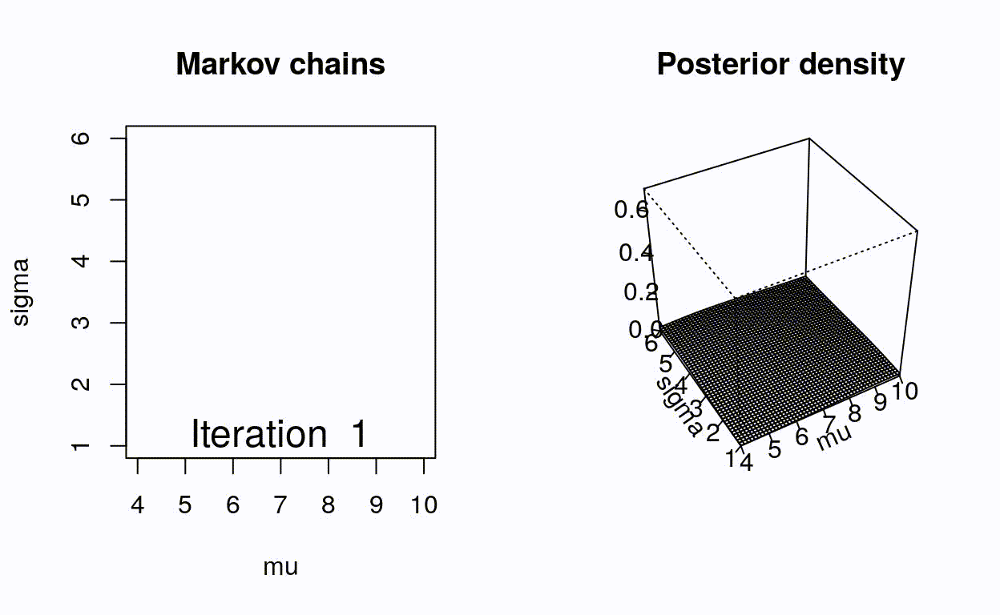

class: inverse

```{r, include=FALSE}
suppressPackageStartupMessages({
  library(tidyverse)
  library(palmerpenguins)
})

library(RefManageR)
BibOptions(check.entries = FALSE,
           bib.style = "authoryear",
           cite.style = "alphabetic",
           style = "markdown",
           hyperlink = FALSE,
           dashed = FALSE)
bib <- ReadBib("./acb.bib", check = FALSE)

theme_set(cowplot::theme_cowplot())
```


# What we'll cover

1. Re-introduction to Bayes rule
2. Markov Chain Monte Carlo: Metropolis-Hastings
3. Variational methods
4. An introduction to Stan


---

# Conventions

* We'll have $N$ samples indexed $n = 1, \ldots, N$

--

* When an output is multidimensional, we'll refer to output dimensions as $p=1,\ldots,P$

--

* Our data for sample $n$ is $y_{n}$ (possibly high dimensional)
  
--

* Our parameter of interest is $\theta$ (possibly high dimensional)

---

# Linking science to statistics

Many scientific questions fundamentally posed as

$$p(\theta | y_1, \ldots, y_N)$$

--

## Examples

* $y_1, \ldots, y_N$ expression measurements across replicates, $\theta$ "true" expression

--

* $y_1, \ldots, y_N$ ctDNA measurements across $N$ cases, $\theta$ "true" ctDNA measurement in case controls 

--

### May also want to compare case to control

$\theta_1$ ctDNA abundance in cases, $\theta_2$ ctDNA abundance in controls

$$p(\theta_1 > \theta_2 | y_1, \ldots, y_N)$$

---

# Rederiving Bayes rule

So how do we get $p(\theta | y)$ ?

--

Remember for any R.V.s $A,B$

$$p(A,B) = p(A|B)p(B) = p(B|A)p(A)$$
--

Substituting $B=\theta$ and $A=y$ and dividing we get **Bayes' rule**:

$$p(\theta|y) = \frac{p(y|\theta)p(\theta)}{p(y)}$$

--

What is this strange $p(y)$?

--

Discrete $\theta$: $p(y) = \sum_{\text{All possible values of } \theta}p(y|\theta)p(\theta)$

--

Continuous $\theta$: $p(y) = \int_{\text{Space of } \theta} p(y|\theta)p(\theta) \mathrm{d} \theta$


---

# A concrete example (of Bayes' rule)

Let $\theta = 1$ if a patient has diabetes, 0 otherwise

--

Let $y$ be the fasting blood sugar level of a patient in mg/dL

--

Let $p(y|\theta=1) = \mathcal{N}(y|135,10)$ and $p(y|\theta=0) = \mathcal{N}(y|80,15)$

--

Let $p(\theta=1) = 0.073$

--

A patient comes with $y=106$ mg/dL. What is the probability they have diabetes?

--

$$p(\theta=1|y) = \frac{p(y|\theta=1)p(\theta=1)}{p(y|\theta=1)p(\theta=1) + p(y|\theta=0)p(\theta=0)}$$

--

$$=\frac{\mathcal{N}(106|135,10) \times 0.073}{\mathcal{N}(106|135,10) \times 0.073 + \mathcal{N}(106|80,15) \times (1-0.073)}$$
--

```{r}
a <- dnorm(106,135,10) * 0.073; b <- dnorm(106,80,15) * (1-0.073)

print(a / (a+b))
```

---

# Credible intervals

Armed with the posterior, we can compute some cool quantities:

> What's the posterior mean of $\theta$?

$$\mathbb{E}_{p(\mathbf{\theta} | \mathbf{Y})} [ \mathbf{\theta} ] = \int \mathbf{\theta} p(\mathbf{\theta} | \mathbf{Y}) \mathrm{d} \theta$$
> What's the probability $\theta$ falls in some region?

$$p(\theta \in [a,b] | \mathbf{Y}) = \int_a^b p(\mathbf{\theta} | \mathbf{Y}) \mathrm{d} \theta$$
--

_This is what you've always wanted a confidence interval to be_

.footnote[
Note: everything is always conditioned on your model!
]


---

# Bayesian inference 

Easy, right?

--

Wrong...as soon as $\mathbf{\theta}$ becomes moderately high dimensional, Bayesian inference becomes _hard_. Why? 

--

$$p(\theta|y) = \frac{\color{darkgreen}{p(y|\theta)}\color{darkblue}{p(\theta)}}{\color{darkred}{\int_{\text{Space of } \theta} p(y|\theta)p(\theta) \mathrm{d} \theta}}$$
$\color{darkgreen}{p(y|\theta)}$ `r icon::fontawesome("arrow-right")` easy to evaluate

$\color{darkblue}{p(\theta)}$ `r icon::fontawesome("arrow-right")` easy to evaluate

$\color{darkred}{\int_{\text{Space of } \theta} p(y|\theta)p(\theta) \mathrm{d} \theta}$ `r icon::fontawesome("arrow-right")` hard to evaluate


---

# The what of Bayesian inference

Most of Bayesian inference comes down to smart ways to approximate $p(\theta|y)$ by only evaluating $\color{darkgreen}{p(y|\theta)}$ and $\color{darkblue}{p(\theta)}$

--

Two main approaches (we'll cover here):

--

1. _Sampling methods_ (e.g. MCMC): draw samples $\theta^s \sim p(\theta|y)$

--

2. _Variational methods_: come up with an easy-to-evaluate distribution $q(\theta)$ and make it as similar as possible to $p(\theta|y)$ while only evaluating $\color{darkgreen}{p(y|\theta)}$ and $\color{darkblue}{p(\theta)}$

---

# Gibbs sampling

Suppose $\mathbf{\theta}$ is high-ish dimensional, i.e.

$$\mathbf{\theta} = [\theta_1, \theta_2, \ldots, \theta_P  ]$$
--

Gibbs sampling (and many other approaches) approximates the distribution $p(\mathbf{\theta} | \mathbf{Y})$

by returning a set of samples

$$\mathbf{\theta}^{(1)}, \mathbf{\theta}^{(2)}, \ldots, \mathbf{\theta}^{(S)}$$
for $S$ samples

--

Remember here each $\mathbf{\theta}^{(s)}$ is $P$ dimensional

--

Using these samples we can take empirical expectations of interesting quantities, e.g.:

> What's the posterior mean of $\mathbf{\theta}$?

$$\mathbb{E}_{p(\mathbf{\theta} | \mathbf{Y})} [ \mathbf{\theta} ] = \int \mathbf{\theta} p(\mathbf{\theta} | \mathbf{Y}) \mathrm{d} \theta \approx \sum_{s=1}^S \mathbf{\theta}^{(s)}$$

---

# Gibbs sampling (II)

So how does Gibbs sampling sample $\mathbf{\theta}^{(s)}$ from $p(\mathbf{\theta} | \mathbf{Y})$ ?

--

Remember $\mathbf{\theta}$ is $P$ dimensional

--

Relies on knowing the conditionals $p(\theta_p | \mathbf{\theta}_{-p}, \mathbf{Y})$ where $\mathbf{\theta}_{-p}$ is all elements of $\mathbf{\theta}$ other than $p$

--

Gibbs sampling proceeds via the following

1. Initialize $\mathbf{\theta}$

2. For each $p \in 1, \ldots, P$ sample $\theta_p \sim p(\theta_p | \mathbf{\theta}_{-p}, \mathbf{Y})$

3. Repeat this whole process a number of times

Then $\mathbf{\theta}^{(1)}, \mathbf{\theta}^{(2)}, \ldots, \mathbf{\theta}^{(S)}$ approximate $p(\mathbf{\theta} | \mathbf{Y})$

--

`r icon::fontawesome("check-circle")` efficient - no samples wasted

`r icon::fontawesome("times-circle")` can get stuck in local optima

---

# Metropolis-Hastings MCMC

Gibbs requires knowing  $p(\theta_p | \mathbf{\theta}_{-p}, \mathbf{Y})$

Metropolis Hastings only requires $p(\mathbf{Y},\theta) = \color{darkgreen}{p(\mathbf{Y}|\theta)}\color{darkblue}{p(\theta)}$

--

## Transition kernel

Need a way to hop around parameter space

--

Introduce $Q(\theta'|\theta)$ interpreted as

> What's the probability I could move to $\theta'$ given I'm at $\theta$?

Common choice $Q(\theta'|\theta) = \mathcal{N}(\theta, \lambda)$ for some $\lambda$

i.e. a ball around $\theta$ with variance $\lambda$

---

# Metropolis-Hastings MCMC (II)

Metropolis Hastings then works as follows:

At $t=1$ initialize $\theta^{(t)}$ --

Then repeatedly:

1. Propose a new $\theta^{(t+1)} \sim Q(\cdot | \theta^{(t)})$ 

--

2. Compute the _acceptance ratio_ 

  $$\alpha = \min(1, \frac{p( \theta^{(t+1)} | \mathbf{Y}) Q(\theta^{(t)} | \theta^{(t+1)}) }{p( \theta^{(t)} | \mathbf{Y}) Q(\theta^{(t+1)} | \theta^{(t)})})$$
--

3. Sample some $u \sim \text{Unif}(0,1)$

--

4. If $u < \alpha$ add $\theta^{(t+1)}$ to my set of samples of $\theta$, otherwise add $\theta^{(t)}$

---

# Metropolis-Hastings MCMC (III)

$$\alpha = \min(1, \frac{p( \theta^{(t+1)} | \mathbf{Y}) Q(\theta^{(t)} | \theta^{(t+1)}) }{p( \theta^{(t)} | \mathbf{Y}) Q(\theta^{(t+1)} | \theta^{(t)})})$$

> Hey! You told use we didn't need to know $p( \theta | \mathbf{Y})$! What's the point in this?

--

$$\alpha = \min(1, \frac{p( \mathbf{Y} | \theta^{(t+1)}) p(\theta^{(t+1)}) \color{darkred}{/ p(\mathbf{Y})} Q(\theta^{(t)} | \theta^{(t+1)}) }{p( \mathbf{Y} | \theta^{(t)}) p(\theta^{(t)}) \color{darkred}{/ p(\mathbf{Y})} Q(\theta^{(t+1)} | \theta^{(t)})})$$

--

As you collect more and more samples of $\theta$, they approximate $p( \theta | \mathbf{Y})$

--

* Often include some _burn in_

* Often sample multiple chains (distinct initializations)

---

# MCMC visualized

.center[

]


.footnote[ Figure from
https://mbjoseph.github.io/posts/2018-12-25-animating-the-metropolis-algorithm/

More reading: https://stephens999.github.io/fiveMinuteStats/MH_intro.html
]


---

# Variational Inference

We know $p(\mathbf{\theta} | \mathbf{Y})$ is hard to evaluate

Let's come up with some simpler distribution $q(\theta | \lambda)$<sup>1</sup> and adjust $\lambda$ to make

.footnote[
[1] _Not_ the same as the proposal distribution in MCMC
]


$$q(\theta | \lambda) \approx p(\mathbf{\theta} | \mathbf{Y})$$
all without directly evaluating $p(\mathbf{\theta} | \mathbf{Y})$

You:

> Gasp! Magic!


---

# Variational Inference (II)

To make $q(\theta | \lambda) \approx p(\mathbf{\theta} | \mathbf{Y})$ we need some idea of a distance<sup>1</sup> between $q$ and $p$

.footnote[
[1] Not actually a distance
]

--

Common choice is Kullback–Leibler divergence (KL-divergence), defined as

$$\text{KL}(q||p) = \mathbb{E}_{q(\theta|\lambda)} [\log q(\theta|\lambda) - \log p(\theta | \mathbf{Y})]$$
$\text{KL}(q||p)=0$ when $p$ and $q$ are the same distribution
 
Idea is to adjust $\lambda$ to minimize $\text{KL}(q||p)$

--

> This still depends on $p(\theta | \mathbf{Y})$!!! What's the point?

---

# Variational Inference (III)

$$\begin{aligned}
\text{KL}(q||p) & = \mathbb{E}_{q(\theta|\lambda)} [\log q(\theta|\lambda) - \log p(\theta | \mathbf{Y})] \\
& = \mathbb{E}_{q(\theta|\lambda)} [\log q(\theta|\lambda) - \log p(\mathbf{Y} | \theta) - \log p(\theta) + \log p(\mathbf{Y})]
\end{aligned}$$

--

$\mathbb{E}_{q(\theta|\lambda)} [ \log p(\mathbf{Y}) ]$ is a constant wrt $\lambda$

so our original minization problem is the same as minizing 

$$\mathbb{E}_{q(\theta|\lambda)} [\log q(\theta|\lambda) - \log p(\mathbf{Y} | \theta) - \log p(\theta)]$$
We only need to evaluate $p(\mathbf{Y} | \theta)$ and $p(\theta)$!

--

## Mean field approximations

Common choice is $q(\theta|\lambda) = \mathcal{N}(\theta | \mu_\lambda, \sigma_\lambda^2)$

--

If $\theta$ is $P$-dimensional, make a _mean field approximation_

$$q(\theta | \lambda) = \prod_{p=1}^P q_p(\theta_p | \lambda_p)$$
---

# Variational Bayes: miscellaneous observations

* Often much faster than MCMC across a range of problems

--

* No guarantee (unlike MCMC<sup>1</sup>) you end up with $p(\theta | \mathbf{Y})$

.footnote[
[1] Asymptotically
]

--

* Much research into making $q$ more flexible

--

* If we have sample specific $z_n$, popular choice is $q(z_n | y_n) = \text{neural_network}(y_n)$

--

* `r Citet(bib, "blei2017variational")` is an excellent overview of the topic

---

# Probabilistic programming languages

## "Normal" programming languages

```{python, eval=FALSE}
x = capture_user_input()
if x == "somevalue":
  # do things
```

* Variables are deterministic*

* Executing the program `r icon::fontawesome("arrow-right")` running instruction set

--

## Probabilistic programming languages

* Variables are random

* Executing the program `r icon::fontawesome("arrow-right")` probabilistic inference

--

PPLs essentially automate statistical inference 


---

# Introduction to STAN

Stan (https://mc-stan.org/) is a PPL for performing

* MCMC

* Variational Bayes

* (Penalized) maximum likelihood estimation

--

## Practicalities

* Compiled language, looks a bit like C++

* Write your models in a `.stan` file

* Interfaces to R and Python (and Matlab, and Julia, and...)

---

# Anatomy of a Stan program

3 main "blocks" in a Stan file

--

## 1. Data

All the _fixed_ variables (i.e. data) get declared here

--

## 2. Parameters

All the variables you want to perform inference

--

## 3. Model

How the data + parameters come together in a statistical model

---

# An example

Suppose $y_n$ is tumour volume, $x_n$ is SNP status (0 or 1)

--

$$y_n \sim \text{LogNormal}(\beta_1 + \beta_2 x_n, \sigma)$$
and we put some funky priors

$$\beta_1, \beta_2 \sim \mathcal{N}(0,1)$$
$$\sigma \sim \text{Gamma}(2, 0.1)$$
--

Real object of inference here is $\beta_1$ (effect of SNP on tumour volume)

Ideally want to target $p(\beta_1 | \mathbf{x}, \mathbf{y})$ ignoring everything else!

---

# The model

```{R, eval=FALSE}
data {
  int<lower = 1> N; // number of samples
  real<lower = 0> y[N]; // tumour volume
  int<lower=0,upper=1> x[N]; // SNP status
}

parameters {
  real beta[2];
  real<lower=0> sigma;
}

model {
  beta ~ normal(0,1);
  sigma ~ gamma(2, 0.1);
  for(n in 1:N) y[n] ~ lognormal(beta[1] + beta[2] * x[n], sigma);
}

```


---

# Inference

```{r, results='hide', echo=FALSE}
N <- 50
x <- sample(c(0,1), N, replace=TRUE)
y <- rexp(N, 0.1 + 0.3 * x)

code <- "data {
  int<lower = 1> N; // number of samples
  real<lower = 0> y[N]; // tumour volume
  int<lower=0,upper=1> x[N]; // SNP status
}

parameters {
  real beta[2];
  real<lower=0> sigma;
}

model {
  beta ~ normal(0,1);
  sigma ~ gamma(2, 0.1);
  for(n in 1:N) y[n] ~ lognormal(beta[1] + beta[2] * x[n], sigma);
}"
```


```{r, message=FALSE, results='hide', warning=FALSE}
library(rstan)
data <- list(N=N, x=x, y=y)
fit <- stan(model_code=code, data=data)
```


---

# Output of Stan fit

```{r, fig.width=6, fig.height=4}
plot(fit)
```


---

# Traceplots


```{r, fig.width=10, fig.height=3}
traceplot(fit)
```


---

# Joint posterior

```{r, fig.height=5, fig.width=5}
pairs(fit, pars=c("beta", "sigma"))
```


---

# Many other probabilistic programming languages

1. PyMC3 - https://docs.pymc.io/

2. Edward - http://edwardlib.org/

3. Pyro - https://pyro.ai/

4. NumPyro - http://num.pyro.ai/en/stable/

.center[

]


---

# References

These slides: [camlab.ca/teaching](https://www.camlab.ca/teaching)


```{r refs, echo=FALSE, results="asis"}
PrintBibliography(bib)
```


