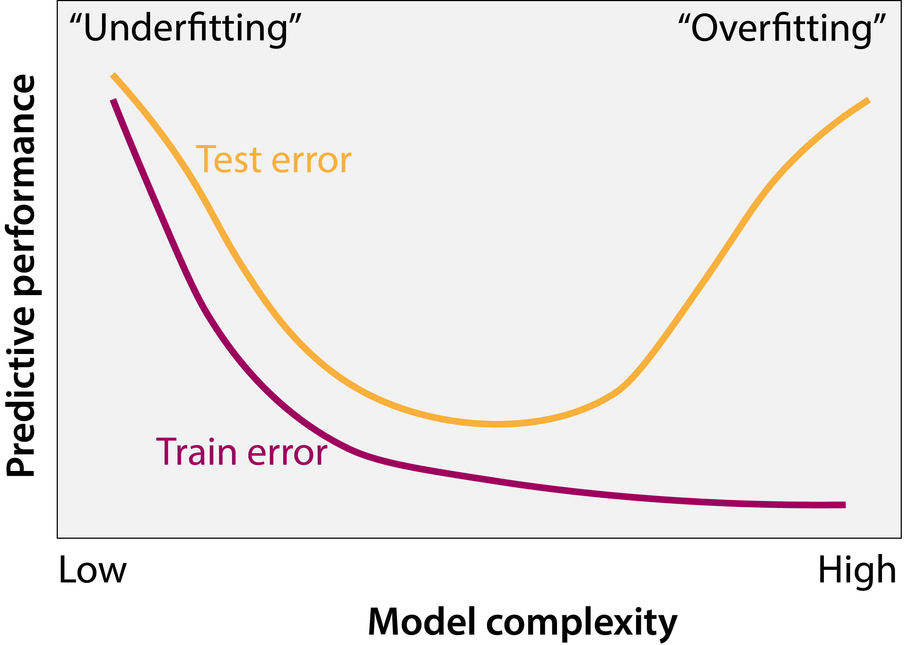

```{r, include=FALSE}
suppressPackageStartupMessages({
  library(tidyverse)
})

theme_set(cowplot::theme_cowplot())
```


class: inverse

# What we'll cover

- What is supervised learning?

- Continuous outputs: linear regression

- Categorical outputs: logistic regression

- A gallery of more sophisticated models

- Controlling model complexity


---


# What is supervised learning?

--

Given some input data, we would like to train a model that _accurately_ predicts a corresponding output

--

## Examples

--

1. Given todays's weather (rainfall, hours of sunshine, average windspeed), will it rain tomorrow?
   - **Input**: today's weather, **output**: tomorrow's weather

--

2. Given a patient's laboratory test values (creatinine, glucose), does the patient have a particular disease?
  - **Input**: lab test values, **output**: diagnosis

--

3. Given a cancer biopsy gene expression measurement, what is the tissue of origin?
  - **Input**: gene expression for a given biopsy, **output**: cancer tissue of origin

---

# What's special compared to other prediction types?


--

Supervised machine learning explicitly involves

1. Past data where you _know_ the correct answer (input output pairs)
2. A model that we train on past data to get _good_ at predicting outputs given inputs

--

Contrast this with:

1. **Rule based predictions**: e.g. if `blood glucose > 125mg/dL`, patient has diabetes
2. **Simulation based predictions**: e.g. use physics simulator to forward simulate tomorrow's weather, given today's

--

## When should we use supervised learning?

If you have sufficient, `r icon::fontawesome("star")` 
**unbiased** `r icon::fontawesome("star")` data, it _may_ be better than other approaches

---

class: top

# What's different from supervised?


Unsupervised learning (typically) has no outputs measured<sup>1</sup>
.footnote[
[1] Very common in biomedical applications
]


Instead we "find structure" in the data


## Examples

1. **Netflix**: are there certain types of viewers who prefer particular genres?

2. **Clinical oncology**: are there subtypes of breast cancer that have similar prognosis / respond similarly to treatment?


###  The line between supervised and unsupervised learning is not always clear cut!

---

class: center

# Gene expression subtypes of pancreatic cancer


---

# The Big Picture

Three ingredients of supervised ML 

1. Some training data (input-output pairs)

--

2. A _model_ that maps **input data** to **output predictions**

--

3. A _loss function_ that measures the discrepancy between the **output prediction** and **output data**

--

we aim to **iteratively improve the model to minimize the loss**.

--

## The Bigger Picture

In probabilistic ML `r icon::fontawesome("arrow-right")` maximize joint probability of the data given the model<sup>1</sup>

.footnote[
[1] Or thereabouts
]

---

class: center, middle

# Starting a supervised learning project

--

Always ask

_is my output continuous or discrete?_


---

# Supervised learning

.pull-left[

## Continuous outputs

* Typically known as _regression_
* Loss is often mean square error
* Example models:
 * Linear regression
 * Polynomial / spline regression
 * Random forests
 * Deep neural networks
 
```{r, echo=FALSE, warning=FALSE, message=FALSE, fig.width=4,fig.height=3}
df <- tibble(
  Input = runif(100),
  Output = 3 * Input - 1 + rnorm(100, 0, 0.4)
)

ggplot(df, aes(x = Input, y = Output)) +
  geom_point() 
```
]

--

.pull-right[

## Discrete outputs

* Typically known as _classification_
* Loss is often binary cross entropy
* Example models:
 * Logistic regression regression
 * Naive Bayes
 * Support vector machines
 * Deep neural networks

```{r, echo=FALSE, warning=FALSE, message=FALSE, fig.width=4,fig.height=3}
sigmoid <- function(x) {
  1 / (1 + exp(-x))
}

df <- tibble(
  Input = runif(100),
  Output = as.factor(round(sigmoid(5 * (Input-0.5)) + rnorm(100, sd=0.05)))
)

ggplot(df, aes(x = Input, y = Output)) +
  geom_point() +
  scale_y_discrete()
```

]

---

class: inverse, center, middle

# Regression (continuous outputs)


---

# Supervised ML

Example problem: predict reduction in tumor volume given expression of a gene

## Notation

$N$ samples indexed by $n = 1, \ldots, N$, _e.g. $N$ patients_

--

Input data $x_n \in \mathbb{R}$ for each sample<sup>1</sup>, _e.g. expression of gene_

.footnote[
[1] In general high dimensional, but we can assume low dimensional here
]

--

Output data $y_n \in \mathbb{R}$ for each sample, _e.g. change in tumour volume_

--

A _model_ $f_\theta$ parametrized by $\theta$ that maps the inputs to predicted outputs $t_n$, i.e.

$$t_n = f_\theta(x_n)$$
--

- $t_n$ is the predicted output for sample $n$
- $y_n$ is the actual output for sample $n$

---

# Defining a loss

We aim to adjust $\theta$ to make $t_n$ as _close_ to $y_n$ averaged over $n$

--

Define some _distance_ between $t_n$ and $y_n$ and minimize wrt $\theta$

--

Common choice: mean squared error

$$\mathrm{MSE(\mathbf{t}, \mathbf{y})} = \frac{1}{N} \sum_{n=1}^N (y_n-t_n)^2$$

--


Remember this is still a function of $\theta$:

$$\mathrm{MSE(\mathbf{t}, \mathbf{y})} = \frac{1}{N} \sum_{n=1}^N (y_n-f_\theta(x_n))^2$$


---

# Linear regression

So what is linear regression? 

--

$$t_n = f_\theta(x_n) = wx_n + b$$
--

* Parameters $\theta = \{w,b\}$

--

* $w$ known as the _weight_, $b$ the bias
--

* Loss now becomes

$$\mathrm{MSE(\mathbf{t}, \mathbf{y})} = \frac{1}{N} \sum_{n=1}^N (y_n-wx_n - b)^2$$

--

Iteratively adjust $w$ and $b$ to minimize $\mathrm{MSE(\mathbf{t}, \mathbf{y})}$

---

# Minimizing losses

So how do we minimize $\mathrm{MSE(\mathbf{t}, \mathbf{y})}$? Strategies:

--

1. Randomly guess<sup>1</sup> $(w,b)$ and choose the values that result in lowest $\mathrm{MSE(\mathbf{t}, \mathbf{y})}$
.footnote[
[1] Not recommended
]

--

2. Differentiate $\mathrm{MSE(\mathbf{t}, \mathbf{y})}$ w.r.t $(w,b)$, set to 0, solve for $(w,b)$

--

3. `r icon::fontawesome("star")` Numerical methods `r icon::fontawesome("star")`
 * Giant scientific field
 * Introduce _gradient descent_ here `r icon::fontawesome("arrow-right")` good in high dimensional problems where gradients of the loss w.r.t. the parameters are available

---

background-image: url('intro-ml_figs/mountain.jpg')
background-position: center
background-size: contain
class: inverse


# Gradient descent


You're at the top of a mountain, it's getting dark, and you need to get down
--
 
* Your position $(x,y)$ is your parameter space $(w,b)$ to explore

--
 
* Your height is $\mathrm{MSE(\mathbf{t}, \mathbf{y})}$ you want to minimize

--

## Q: What's the strategy?

--

Take successive little steps downhill until things flatten out

--

## Local optimality

Note this doesn't guarantee you to get to the _bottom_, only to a much flatter region

 `r icon::fontawesome("arrow-right")` Big problem depending on shape of your mountain / loss function

---

# What is downhill?

> successive little steps downhill

--

.pull-left[
Consider $y=(x-1)^2$, $\frac{\mathrm{d}y}{\mathrm{d}x} = 2(x-1)$
]

.pull-right[
```{r, echo=FALSE, fig.align='center', fig.width=4,fig.height=4}
ggplot() + xlim(-3, 5) + 
  geom_function(fun = function(x) (x-1)^2) + 
  geom_vline(xintercept = 1, color='grey50', linetype=2) +
  labs(x="x", y="y")
```
]

--

Notice:
* When $x > 1$ we want to go to the _left_ and $\frac{\mathrm{d}y}{\mathrm{d}x} > 0$
* When $x < 1$ we want to go to the _right_ and  $\frac{\mathrm{d}y}{\mathrm{d}x} < 0$

The sign of the gradient always points uphill!

---

# Gradient descent

This suggests an iterative scheme:

1. Initialize some values for $(w,b)$

--

2. For a given number of steps:
 * Update $w \leftarrow w - \epsilon \frac{\partial}{\partial w} \mathrm{MSE(\mathbf{t}, \mathbf{y}; w, b)}$
 * Update $b \leftarrow b - \epsilon \frac{\partial}{\partial b} \mathrm{MSE(\mathbf{t}, \mathbf{y}; w, b)}$

--

3. Monitor $MSE(\mathbf{t}, \mathbf{y}; w, b)$ - if it "levels off" we can end with the optimal values $(w,b)$

--

## Learning rate

$\epsilon>0$ is known as the _learning rate_ or _step size_. 

* Important parameter to tune: too large and you overshoot, too small and it's inefficient


---

class: inverse, center, middle

# Logistic regression (discrete outputs)


---


# Logistic regression

* Previously: $y_n$ was continuous `r icon::fontawesome("arrow-right")` regression
* Now: $y_n$ binary i.e. $y_n = 0$ or $1$ `r icon::fontawesome("arrow-right")` logistic regression

--

Instead of modelling $y_n \approx t_n = wx_n + b$ we're now interested in modelling

$$p(y_n=1 | x_n) $$
--

Examples

* $y_n=1 \rightarrow$ patient has diabetes, $x_n \rightarrow$ blood glucose, $p(y_n=1 | x_n) \rightarrow$ "_what's the probability the patient has diabetes?_"
* $y_n=1 \rightarrow$ CRISPR guide RNA has off target effect, $x_n \rightarrow$ GC content

As before, require $(y_n, x_n)$ _training points_ for $n=1,\ldots,N$

---

# Loss function for logistic regression

Let's define $\pi_n = p(y_n=1 | x_n)$. What is $p(y_n)$ ?


--

* If $y_n=1$ then $p(y_n) = \pi_n$
--

* If $y_n=0$ then $p(y_n) = 1-\pi_n$

--

We can write this as

$$p(y_n) = \pi_n^{y_n} (1-\pi_n)^{1-y_n}$$
For multiple observations $y_1, \ldots, y_N$ we assume 

$$p(y_1, \ldots, y_N) = \prod_{n=1}^N \pi_n^{y_n} (1-\pi_n)^{1-y_n}$$
--

Normal to consider the log and maximize 
$$\log p(y_1, \ldots, y_N) = \sum_{n=1}^N \left[ y_n \log(\pi_n) + (1-y_n) \log(1-\pi_n) \right]$$


---

# Logistic regression: modelling probabilities

What's left? Need to specify how $\pi_n = p(y_n=1|x_n)$ depends on $x_n$ !

.pull-left[
Common choice: logistic function

$$\pi_n = \frac{1}{1 + \exp\left( -(wx_n + b) \right)}$$
]
.pull-right[

]

Has the additional interpretation that the log-odds for a data point is linear in the covariates:

$$\log \frac{\pi_n}{1-\pi_n} = wx_n + b$$

???

Many other possibilities for the function

---

# Putting it all together

Our loss:

$$l(w,b) = - \sum_{n=1}^N \left[ y_n \log(\pi_n) + (1-y_n) \log(1-\pi_n) \right]$$
where

$$\pi_n = \frac{1}{1 + \exp\left( -(wx_n + b) \right)}$$
--

Would like to minimize $l(w,b)$ wrt $w,b$

* Could use gradient descent as before since derivatives of $l$ are computable
* Better to use built-in implementations in R/Python/...


---

# Logistic regression example

.pull-left[
```{r, echo=FALSE, warning=FALSE, message=FALSE, fig.width=4,fig.height=3}
sigmoid <- function(x) {
  1 / (1 + exp(-x))
}

x = runif(100)
y = as.factor(round(sigmoid(5 * (x-0.5)) + rnorm(100, sd=0.05)))

df <- tibble(
  x=x,
  y=y
)

y <- as.numeric(y)-1

ggplot(df, aes(x = x, y = y)) +
  geom_point() +
  scale_y_discrete()
```

]

--

.pull-right[

```{r warning=FALSE, message=FALSE, fig.width=4,fig.height=3}
df <- data.frame(y = y, x = x)
fit <- glm(y ~ x, data = df, 
           family='binomial')
df$predicted <- predict(fit, 
                        type='response')

ggplot(df, aes(x = x, y = y)) +
  geom_point(alpha=.5) +
  geom_line(aes(y = predicted), 
            colour='darkred', size=1.5)
```


]

---

class: inverse, center, middle

# Moving past linear to more complex models


---

# Moving past linear models

So far we have modelled

1. [Linear regression] The predicted output $t_n(x_n)$
2. [Logistic regression] The conditional probabilities $p(y_n|x_n)$

_linearly_ as a function of $x_n$ via $wx_n + b$

Almost certainly underestimates complexity of true relationship:

* Higher order moments, e.g. $x^2, x^3$
* Interactions between inputs, e.g. if $\mathbf{x_n}$ is a vector, $x_{1,n} \times x_{2,n}$ 


---

# Examples of more complex algorithms

1. Polynomial regression
  
  Model $y = m_0 + m_1 x + m_2 x^2 + m_3 x^3 + ...$
  
--
  
2. Decision trees / random forests
  
  Ask series of binary questions about input to arrive at output
  
--
  
3. Deep neural networks

  Model output as series of function compositions $y_n = f_K(f_{K-1}(...f_1(x_n)...))$
  
  where 
  
  $$f_k(x) = \sigma(wx+b)$$
  $\sigma$ often called _nonlinearity_, e.g. sigmoid, tanh, ReLU

---

# Controlling model complexity

.pull-left[


Consider

$$y_n = x_n \log(x_n) + \epsilon_n$$
$$\epsilon_n \sim \text{N}(0,1)$$

> $\epsilon_n$ is drawn from a **N**ormal distribution with mean 0 and standard deviation 1


]

--

.pull-right[
```{r, fig.width=5, fig.height=3}
set.seed(123456)
x <- runif(100)
y <- x * log(x) + 
  rnorm(100, sd=0.1)
qplot(x,y)
```
]


---

# Controlling model complexity

.pull-left[

## Linear fit 
```{r, fig.width=5, fig.height=3}
fit <- lm(y ~ x)
df <- data.frame(x,y,
                 t=predict(fit))

ggplot(df, aes(x=x)) +
  geom_point(aes(y=y)) +
  geom_line(aes(y=t), colour='red')
```

]

--

.pull-right[

## High degree polynomial fit

```{r, fig.width=5, fig.height=3}
fit <- lm(y ~ poly(x, 20))
df <- data.frame(x,y,
                 t=predict(fit))

ggplot(df, aes(x=x)) +
  geom_point(aes(y=y)) +
  geom_line(aes(y=t), colour='red')
```
]

---

# How do we set the model complexity?

Basic idea: tune model complexity by optimizing performance on held out dataset


.center[Credit: _Wikipedia_]


---

# Practical example

## Create train and test datasets

$y_n = x_n + 5 x_n^2 + \epsilon, \; \; x_n \sim \text{Unif}(0,1), \epsilon \sim \text{N}(0, 0.01)$

```{r}
set.seed(123456)
x_train <- runif(100); x_test <- runif(100)
y_train <- x_train + 5 * x_train^2 + 
  rnorm(100, sd=0.5)
y_test <- x_train + 5 * x_train^2 + 
  rnorm(100, sd=0.5)
```

--

## Fit models on test sets

```{r}
models <- lapply(1:20, function(i) {
  lm(y_train ~ poly(x_train, i))
})
```

---

# Practical example

## Compute mean squared error on test set

```{r}
mse <- sapply(models, function(fit) {
  test_predictions <- predict(fit, newdata=data.frame(x=x_test))
  mean((y_test-test_predictions)^2)
})
```

```{r, fig.width=7, fig.height=3, fig.align='center'}
qplot(1:20, mse) +
  labs(x = "Degree of polynomial", y = "Mean squared error (test)")
```


---

# Overfitting and underfitting

* If your model is too complex, it adapts to the noise in the training set `r icon::fontawesome("arrow-right")` **overfitting**

--

* If your model is too simple, it can't approximate the true function/decision boundary `r icon::fontawesome("arrow-right")` **underfitting**

--

.center[
  
  ]


--

* Closely related to bias-variance tradeoff


---

# Controlling model complexity: penalized models

Popular method for controlling model complexity is penalizing coefficient size

--

Consider $P$ input variables `r icon::fontawesome("arrow-right")` $P$ coefficients

$$y_n = \sum_{p=1}^P w_p x_{np} + \epsilon$$
--

Would like to keep entries of $\mathbf{w}$ _small_ and/or _sparse_

--

Do this by minimizing

$$\text{MSE}(\mathbf{y}, \mathbf{t}) + \lambda \times \text{size}(\mathbf{w})$$
--

* How we specify $\text{size}(\mathbf{w})$ gives different properties 

--

* $\lambda$ controls the trade-off between predictive accuracy and model complexity

--

* Typically set $\lambda$ via optimizing accuracy on test set


---

# Choice of penalties

.pull-left[

## L2 norm (_Ridge_)

Set $\text{size}(\mathbf{w}) = \sqrt{\sum_{p=1}^P w_p^2}$

Leads to non-sparse solutions with small coefficients

]

--

.pull-right[

## L1 norm (_Lasso_)

Set $\text{size}(\mathbf{w}) = \sum_{p=1}^P |w_p|$

Leads to sparse solutions

Combination L2 + L1 norms _elasticnet_

]

--


## Implementations

R: [glmnet](https://web.stanford.edu/~hastie/glmnet/glmnet_alpha.html)

Python: [sklearn](https://scikit-learn.org/stable/auto_examples/linear_model/plot_lasso_and_elasticnet.html)


---

# Wrap up

1. Supervised learning requires existing input-output pair data

--

2. Output is continuous `r icon::fontawesome("arrow-right")` regression `r icon::fontawesome("arrow-right")`mean square error

--

3. Output is binary `r icon::fontawesome("arrow-right")` classification `r icon::fontawesome("arrow-right")` binary cross entropy

--

4. We can minimize loss functions in multiple ways including gradient descent

--

5. Many complex models beyond linear including random forests and deep neural networks

--

6. Using too complex a model can lead to _overfitting_

--

7. We can reduce model complexity by penalizing coefficient sizes

--

8. We can select model complexity by optimizing performance on a held-out test set

---

# Resources 

Bishop's _Pattern Recognition and Machine Learning_ is [free online]http://users.isr.ist.utl.pt/~wurmd/Livros/school/Bishop%20-%20Pattern%20Recognition%20And%20Machine%20Learning%20-%20Springer%20%202006.pdf)


---
