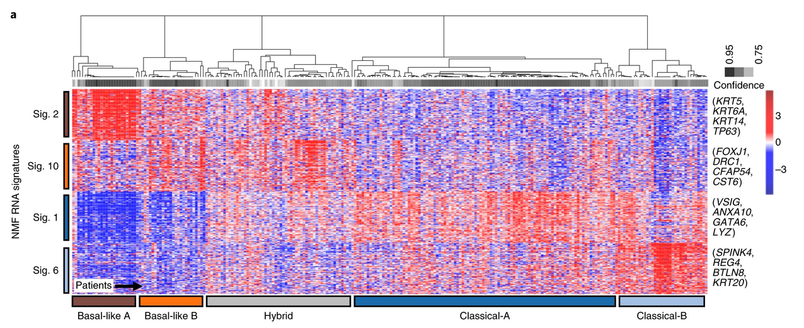

```{r, include=FALSE}
suppressPackageStartupMessages({
  library(tidyverse)
})

theme_set(cowplot::theme_cowplot())
```


class: inverse

# What we'll cover

- What is supervised learning?

- Continuous outputs: linear regression

- Categorical outputs: logistic regression

- A gallery of more sophisticated models

- Controlling model complexity


---


# What is supervised learning?

--

Given some input data, we would like to train a model that _accurately_ predicts a corresponding output

--

## Examples

--

1. Given todays's weather (rainfall, hours of sunshine, average windspeed), will it rain tomorrow?
   - **Input**: today's weather, **output**: tomorrow's weather

--

2. Given a patient's laboratory test values (creatinine, glucose), does the patient have a particular disease?
  - **Input**: lab test values, **output**: diagnosis

--

3. Given a cancer biopsy gene expression measurement, what is the tissue of origin?
  - **Input**: gene expression for a given biopsy, **output**: cancer tissue of origin

---

# What's special compared to other prediction types?


--

Supervised machine learning explicitly involves

1. Past data where you _know_ the correct answer (input output pairs)
2. A model that we train on past data to get _good_ at predicting outputs given inputs

--

Contrast this with:

1. **Rule based predictions**: e.g. if `blood glucose > 125mg/dL`, patient has diabetes
2. **Simulation based predictions**: e.g. use physics simulator to forward simulate tomorrow's weather, given today's

--

## When should we use supervised learning?

If you have sufficient, `r icon::fontawesome("star")` 
**unbiased** `r icon::fontawesome("star")` data, it _may_ be better than other approaches

---

class: top

# What's different from supervised?


Unsupervised learning (typically) has no outputs measured<sup>1</sup>
.footnote[
[1] Very common in biomedical applications
]


Instead we "find structure" in the data


## Examples

1. **Netflix**: are there certain types of viewers who prefer particular genres?

2. **Clinical oncology**: are there subtypes of breast cancer that have similar prognosis / respond similarly to treatment?


###  The line between supervised and unsupervised learning is not always clear cut!

---

class: center

# Gene expression subtypes of pancreatic cancer



---

# The Big Picture

Three ingredients of supervised ML 

1. Some training data (input-output pairs)

--

2. A _model_ that maps **input data** to **output predictions**

--

3. A _loss function_ that measures the discrepancy between the **output prediction** and **output data**

--

we aim to **iteratively improve the model to minimize the loss**.

--

## The Bigger Picture

In probabilistic ML `r icon::fontawesome("arrow-right")` maximize joint probability of the data given the model<sup>1</sup>

.footnote[
[1] Or thereabouts
]

---

class: inverse, center, middle

# The Great Divide

--

Always ask

_is my output continuous or discrete?_


---

# Supervised learning

.pull-left[

## Continuous outputs

* Typically known as _regression_
* Loss is often mean square error
* Example models:
 * Linear regression
 * Polynomial / spline regression
 * Random forests
 * Deep neural networks
 
```{r, echo=FALSE, warning=FALSE, message=FALSE, fig.width=4,fig.height=3}
df <- tibble(
  Input = runif(100),
  Output = 3 * Input - 1 + rnorm(100, 0, 0.4)
)

ggplot(df, aes(x = Input, y = Output)) +
  geom_point() 
```
]

--

.pull-right[

## Discrete outputs

* Typically known as _classification_
* Loss is often binary cross entropy
* Example models:
 * Logistic regression regression
 * Naive Bayes
 * Support vector machines
 * Deep neural networks

```{r, echo=FALSE, warning=FALSE, message=FALSE, fig.width=4,fig.height=3}
sigmoid <- function(x) {
  1 / (1 + exp(-x))
}

df <- tibble(
  Input = runif(100),
  Output = as.factor(round(sigmoid(5 * (Input-0.5)) + rnorm(100, sd=0.05)))
)

ggplot(df, aes(x = Input, y = Output)) +
  geom_point() +
  scale_y_discrete()
```

]

---

# Supervised ML

Example problem: predict reduction in tumor volume given expression of a gene

## Notation

$N$ samples indexed by $n = 1, \ldots, N$, _e.g. $N$ patients_

--

Input data $x_n \in \mathbb{R}$ for each sample<sup>1</sup>, _e.g. expression of gene_

.footnote[
[1] In general high dimensional, but we can assume low dimensional here
]

--

Output data $y_n \in \mathbb{R}$ for each sample, _e.g. change in tumour volume_

--

A _model_ $f_\theta$ parametrized by $\theta$ that maps the inputs to predicted outputs $t_n$, i.e.

$$t_n = f_\theta(x_n)$$
--

- $t_n$ is the predicted output for sample $n$
- $y_n$ is the actual output for sample $n$

---

# Defining a loss

We aim to adjust $\theta$ to make $t_n$ as _close_ to $y_n$ averaged over $n$

Define some _distance_ between $t_n$ and $y_n$ and minimize wrt $\theta$

---


---
